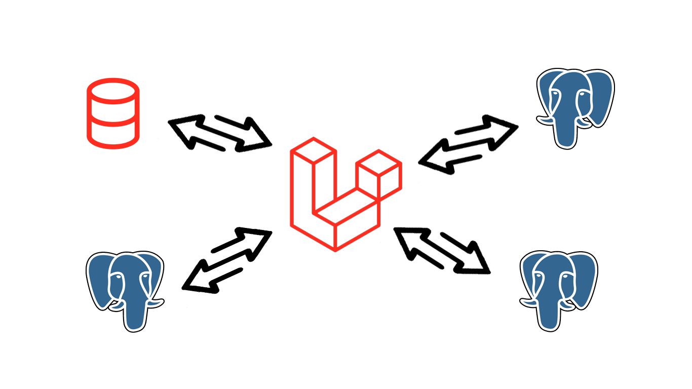

# Task Scheduler Laravel!



## IN A NUTSHELL
In Laravel, the task scheduler allows you to define scheduled tasks that can be executed automatically at specified intervals. It uses the schedule method in the App\Console\Kernel class. Here’s a quick guide to understanding and setting up the task scheduler in Laravel:

## Advantages
1. **Ease of Use:** Laravel provides an intuitive and user-friendly interface for database backup, making it accessible even to those with limited technical knowledge.
2. **Automation:** Laravel's scheduling capabilities allow for automated backups, ensuring data is regularly saved without manual intervention.
3. **Security:** The framework includes built-in security features to protect your backups from unauthorized access.
4. **Flexibility:** Laravel supports various database types and allows customization of backup processes to fit specific needs.
5. **Integration:** Seamless integration with other Laravel components and third-party tools enhances the functionality of your backup system.

## Disadvantages
1. **Complexity for Large Databases:** Managing backups for very large databases can become complex and may require additional configuration and resources.
2. **Resource Intensive:** Automated backups can be resource-intensive, potentially affecting the performance of your application during the backup process.

## Recommendations
**Regular Testing:** Regularly test your backup and restore procedures to ensure they work correctly and can be relied upon in an emergency.

## How to Run
1. Set the databases connections.
2. Run the following command:

````
php artisan schedule:run
